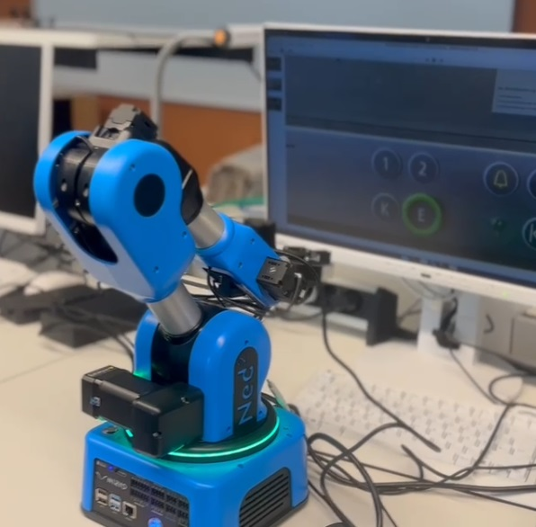
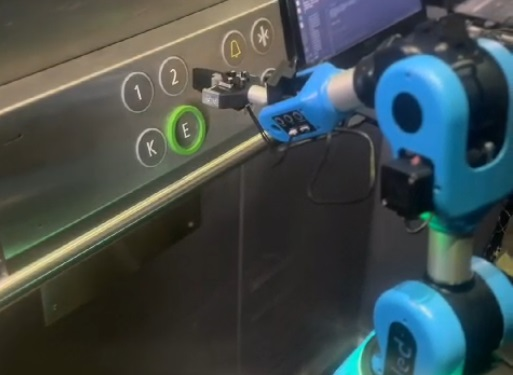

# Niryo Ned2 Robot for Elevator Button Detection

<div align="center">
    
</div>


This project controls the Niryo Ned2 robotic arm using a YOLO image detection model to detect and press elevator buttons.

## Project Description

The main file of the project is `project.py`, which contains the general code. The process is as follows:

1. Connect to the robot.
2. The robot moves to the initial position, waits for 2 seconds, and takes a picture.
3. The system asks the user which floor they want to go to. Based on the input number, the robot sends this information to the YOLO model.
4. The YOLO model returns the coordinates of the desired button.
5. If the button is already pressed, it will display the message "Button is already pressed".
6. If the button is not pressed, the YOLO model will send the coordinates of the desired button.
7. Using inverse kinematics, the angles for each joint of the robot are calculated to reach the button's position.
8. Once the robot is in front of the button, it will move forward, wait for one second, and move backward to press the button.
9. After this, the robot waits for 5 seconds and then goes to sleep mode.

## Directory Structure

- The `yolov5` folder contains all codes and datasets for button detection.
- The `Pressed_NonPressed_model` folder contains all codes and datasets for pressed/unpressed button detection.

## Running the Code

### With Niryo Arm

1. Activate virtual environment:
```
source robotics/bin/activate
```
or create a new virtual environment and install "requirements.txt" using the following command and activate that environment:
```
pip install -r /path/to/requirements.txt
```
2. Intreget Niryo Arm2 with a laptop using the following password:
```
niryorobot
```
3.  Run the following command from the activated virtual environment

```
python project.py 
```

### Without Niryo Arm


1. Activate virtual environment:
```
source robotics/bin/activate
```
or create a new virtual environment, install the dependencies from `requirements.txt`, and activate that environment:
```
pip install -r /path/to/requirements.txt
```
2. Change the `image_path` in `main.py`. There are some test images in the `test_image` folder.
   
3.  Run the following command from the activated virtual environment

```
python main.py 
```
## Video Demonstration

You will find some demo videos in the Videos folder


<div align="center">
    
</div>